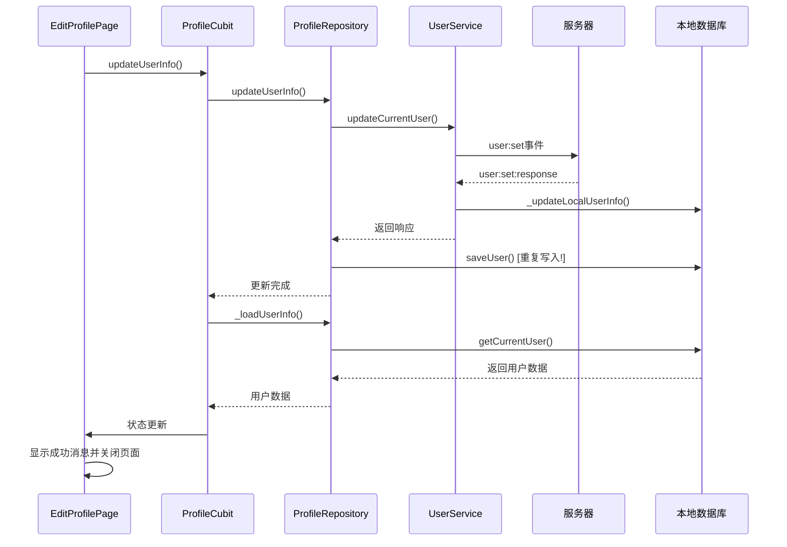

# ProfilePage更新逻辑分析

## 整体架构

ProfilePage使用标准的Flutter BLoC模式：
```
ProfilePage → ProfileCubit → ProfileRepository → UserService → 服务器
```

## 详细更新流程

### 1. 数据加载流程

#### 初始化加载
```dart
// ProfileCubit构造函数
ProfileCubit() {
  _loadUserInfo(); // 自动加载用户信息
}

// 加载逻辑
Future<void> _loadUserInfo() async {
  emit(state.copyWith(status: ProfileStatus.loading));
  final user = await _repository.getCurrentUser(); // 从本地数据库获取
  emit(state.copyWith(status: ProfileStatus.success, user: user));
}
```

#### 手动刷新
```dart
// 用户可以通过下拉菜单手动刷新
Future<void> refreshUserInfo() async {
  await _loadUserInfo(); // 重新从数据库加载
}
```

### 2. 用户信息更新流程

#### 两种更新方式

**方式1：普通信息更新（昵称、状态等）**
```dart
// EditProfilePage → ProfileCubit
profileCubit.updateUserInfo(
  nickname: _nicknameController.text.trim(),
  status: _statusController.text.trim(),
);

// ProfileCubit → ProfileRepository
await _repository.updateUserInfo(
  nickname: nickname,
  avatar: avatar,
  status: status,
);

// ProfileRepository → UserService
final response = await userService.updateCurrentUser(
  name: nickname,
  avatar: avatar,
  status: status,
);
```

**方式2：头像更新（特殊处理）**
```dart
// EditProfilePage直接调用UserService
final response = await UserService.instance.uploadAvatar(
  _selectedAvatarFile!,
  onProgress: (progress) => setState(() => _uploadProgress = progress),
);

// 头像上传成功后直接返回，不再调用ProfileCubit
if (response?.success == true) {
  UINotificationService().showSuccess('个人信息更新成功');
  Navigator.pop(context);
  return; // 直接返回！
}
```

### 3. 本地数据同步逻辑

#### ProfileRepository的双重更新
```dart
Future<void> updateUserInfo({...}) async {
  // 1. 发送到服务器
  final response = await userService.updateCurrentUser(...);
  
  // 2. 服务器成功后，手动更新本地数据库
  if (response.hasUser()) {
    final updatedUser = userService.currentUserFromProto(response.user);
    await saveUser(updatedUser); // 保存到本地数据库
  }
}
```

#### UserService的自动同步（我们刚修复的）
```dart
// UserService现在也会自动更新本地数据
if (response.success) {
  await _updateLocalUserInfo(response.user); // 自动同步到本地
}
```

### 4. UI状态管理

#### 状态监听和更新
```dart
// ProfilePage监听ProfileCubit状态变化
BlocBuilder<ProfileCubit, ProfileState>(
  builder: (context, state) {
    switch (state.status) {
      case ProfileStatus.loading:
        return CircularProgressIndicator();
      case ProfileStatus.success:
        return _buildContent(state.user);
      case ProfileStatus.error:
        return ErrorWidget(state.error);
    }
  },
)
```

#### EditProfilePage的实时同步
```dart
// EditProfilePage监听ProfileCubit状态变化
BlocConsumer<ProfileCubit, ProfileState>(
  listener: (context, state) {
    if (state.status == ProfileStatus.success) {
      UINotificationService().showSuccess('个人信息更新成功');
      Navigator.pop(context); // 自动关闭编辑页面
    }
  },
  builder: (context, state) {
    // 当状态更新时，自动同步到输入框
    if (state.user != null) {
      _nicknameController.text = state.user!.name;
      _statusController.text = state.user!.status ?? '';
      // ...
    }
  },
)
```

## 存在的问题和改进建议

### 🔍 发现的问题

#### 1. 双重数据同步问题
- **ProfileRepository** 手动同步本地数据库
- **UserService** 也自动同步本地数据库
- 可能导致重复写入和竞态条件

#### 2. 头像更新逻辑不一致
```dart
// 头像更新直接调用UserService，绕过了ProfileCubit
final response = await UserService.instance.uploadAvatar(...);
// 但ProfilePage的UI状态没有更新！
```

#### 3. 状态不一致风险
- 头像上传成功后直接返回，ProfileCubit状态没有更新
- 用户回到ProfilePage时可能看到旧的头像

### ✅ 建议的改进方案

#### 1. 统一数据同步策略
```dart
// 建议：只在UserService中进行本地同步
// ProfileRepository不再手动同步
Future<void> updateUserInfo({...}) async {
  final response = await userService.updateCurrentUser(...);
  
  if (!response.success) {
    throw Exception('更新失败: ${response.message}');
  }
  
  // 不再手动同步，让UserService自动处理
  // UserService的_updateLocalUserInfo会自动同步
}
```

#### 2. 修复头像更新流程
```dart
// 建议：头像上传后通知ProfileCubit刷新
if (response?.success == true) {
  // 通知ProfileCubit刷新状态
  profileCubit.refreshUserInfo();
  
  UINotificationService().showSuccess('个人信息更新成功');
  Navigator.pop(context);
}
```

#### 3. 添加数据一致性检查
```dart
// 建议：在ProfileCubit中添加数据一致性检查
Future<void> ensureDataConsistency() async {
  final localUser = await _repository.getCurrentUser();
  final serverUser = await _repository.fetchUserFromServer();
  
  if (localUser?.lastModified != serverUser?.lastModified) {
    // 数据不一致，需要同步
    await _repository.syncUserData();
  }
}
```

## 完整的更新时序图



## 总结

### 当前逻辑的特点
1. **✅ 完整的状态管理**：使用BLoC模式管理UI状态
2. **✅ 自动UI更新**：状态变化时UI自动刷新
3. **✅ 错误处理**：完整的错误处理和用户反馈
4. **❌ 双重数据同步**：ProfileRepository和UserService都在同步数据
5. **❌ 头像更新不一致**：头像更新绕过了ProfileCubit

### 改进建议
1. **统一数据同步策略**：只在UserService中进行本地同步
2. **修复头像更新流程**：确保所有更新都通过ProfileCubit
3. **添加数据一致性检查**：防止本地和服务器数据不一致
4. **优化性能**：避免重复的数据库写入操作

总的来说，ProfilePage的更新逻辑是比较完整的，但存在一些可以优化的地方，特别是数据同步的一致性和效率问题。 