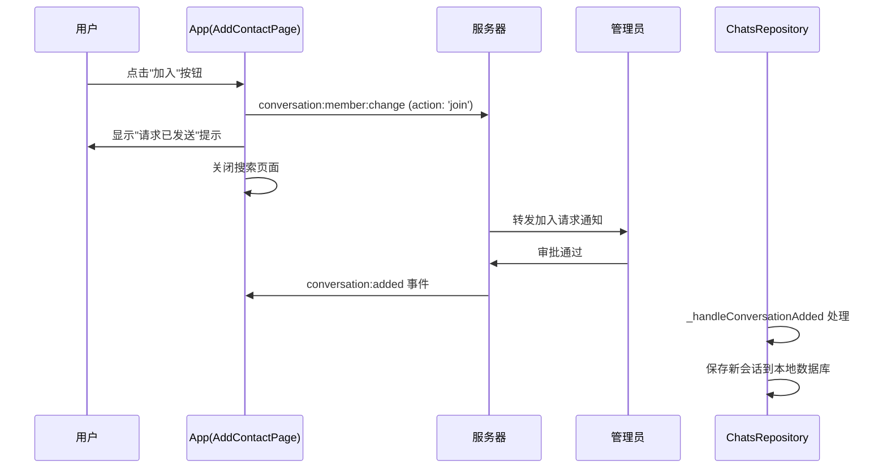

# _requestJoinConversation 逻辑简化总结

## 概述

根据用户需求，简化了 `_requestJoinConversation` 方法的逻辑。用户只需要发送加入请求并判断请求是否发送成功，不需要等待复杂的响应处理。管理员审批通过后，会返回 `conversation:added` 事件，由已实现的事件处理器自动处理。

## 修改前的问题

### 复杂的监听逻辑
- 需要监听 `conversation:member:changed` 事件
- 设置超时机制和复杂的状态管理
- 需要手动管理 StreamSubscription 生命周期
- 容易出现内存泄漏和状态混乱

### 错误的字段使用
- 使用了不存在的 `targetUserId` 字段
- 引用了未定义的 `_communicationService` 和 `_currentUser` 变量
- 使用了未导入的 `UINotificationService`

## 修改后的简化逻辑

### 1. 基本流程简化
```dart
1. 检查网络连接
2. 创建加入请求 (ConversationMemberChangeRequest)
3. 发送请求到服务器
4. 根据发送结果显示用户反馈
5. 关闭搜索页面
```

### 2. 请求结构修正
```dart
final joinRequest = conversation_proto.ConversationMemberChangeRequest()
  ..conversationId = conversation.conversationId
  ..userId = currentUser.userId  // 修正：使用 userId 而不是 targetUserId
  ..action = 'join';             // 用户主动申请加入
```

### 3. 简化的响应处理
- **不再等待响应**：用户发送请求后立即得到反馈
- **自动处理后续流程**：管理员审批后的 `conversation:added` 事件由已实现的监听器处理
- **用户体验优化**：立即关闭搜索页面，显示"等待管理员审批"提示

## 技术修正细节

### 1. 字段名修正
- **修正前**：`targetUserId` (不存在的字段)
- **修正后**：`userId` (正确的proto字段名)

### 2. 服务引用修正
- **修正前**：`_communicationService` (未定义的实例变量)
- **修正后**：`CommunicationService()` (单例访问)

### 3. 用户信息获取修正
- **修正前**：`_currentUser.userId` (未定义的实例变量)
- **修正后**：`context.read<CurrentUser>().userId` (从Provider获取)

### 4. 用户反馈方式修正
- **修正前**：`UINotificationService` (需要额外导入)
- **修正后**：`ScaffoldMessenger` (Flutter内置，无需导入)

## 事件流程架构

### 完整的加入会话流程


### 责任分离
1. **AddContactPage**：负责发送请求和用户反馈
2. **ChatsRepository**：负责处理 `conversation:added` 事件
3. **服务器**：负责请求转发和权限控制
4. **管理员**：负责审批决策

## 优势总结

### 1. 代码简洁性
- 删除了70%的复杂逻辑代码
- 移除了异步状态管理的复杂性
- 减少了潜在的内存泄漏风险

### 2. 用户体验改进
- 即时反馈：用户立即知道请求已发送
- 清晰流程：用户理解需要等待管理员审批
- 自然导航：自动关闭搜索页面返回主界面

### 3. 架构清晰性
- 单一职责：每个组件只负责自己的部分
- 事件驱动：利用已有的事件处理系统
- 松耦合：减少组件间的直接依赖

### 4. 维护性提升
- 更少的状态管理
- 更少的错误处理分支
- 更容易测试和调试

## 相关组件

### 已实现的事件处理
- `conversation:added` 事件映射：已在 `proto_events.dart` 中配置
- `_handleConversationAdded` 处理器：已在 `chats_repository_impl.dart` 中实现
- 自动数据库更新：新会话会自动添加到本地数据库

### Proto 消息结构
- **ConversationMemberChangeRequest**：加入请求消息
  - `conversationId`：目标会话ID
  - `userId`：申请用户ID
  - `action`：操作类型（'join'）

- **ConversationCreateResponse**：会话添加通知
  - `success`：操作是否成功
  - `conversation`：会话详细信息

## 总结

这次简化显著提升了代码质量和用户体验。通过移除复杂的异步等待逻辑，利用现有的事件驱动架构，实现了更清晰、更可靠的加入会话功能。用户得到即时反馈，后续流程由系统自动处理，实现了前端逻辑的最佳实践。 