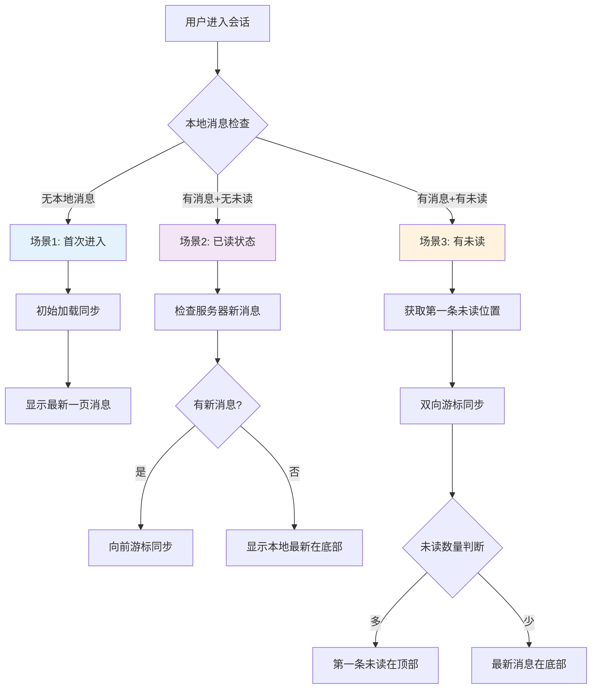

# 完整的进入会话逻辑设计

## 概述

结合多端同步需求和用户体验优化，设计一套完整的进入会话逻辑，使用多游标系统确保数据一致性。

## 三种进入会话场景

### 场景1：首次进入会话（本地无消息）

```dart
async enterConversationFirstTime(String conversationId) {
  // 1. 使用初始加载游标同步
  final result = await chatRepository.syncMessagesInitial(
    conversationId,
    limit: 50, // 获取最新50条消息
  );
  
  // 2. 根据返回消息数量决定UI展示
  if (result.returnedCount >= 50) {
    // 可能有更多历史消息
    showWithLoadMoreOption();
  } else {
    // 显示全部消息，到达历史起点
    showCompleteHistory();
  }
  
  // 3. 设置游标位置
  await updateLocalCursor(conversationId, result.nextCursor);
  await updateSyncCursor(conversationId, result.nextCursor);
}
```

### 场景2：已读状态进入（本地有消息，无未读）

```dart
async enterConversationWithoutUnread(String conversationId) {
  // 1. 获取本地最新消息游标
  final localLatestCursor = await getLocalLatestMessageCursor(conversationId);
  
  // 2. 发送游标给服务器检查是否有新消息
  final checkResult = await chatRepository.checkForNewMessages(
    conversationId,
    fromCursor: localLatestCursor,
  );
  
  if (checkResult.hasNewMessages) {
    // 3a. 有新消息：使用向前游标同步
    final syncResult = await chatRepository.syncMessagesForward(
      conversationId,
      cursor: localLatestCursor,
      limit: 50,
    );
    
    // 根据新消息数量决定展示方式
    if (syncResult.returnedCount > uiPageSize) {
      // 新消息过多：显示提示，让用户选择是否跳到最新
      showNewMessagesPrompt(syncResult.returnedCount);
    } else {
      // 新消息适量：自动滚动到最新，显示所有新消息
      showLatestWithAutoScroll();
    }
  } else {
    // 3b. 无新消息：直接显示本地最新消息在底部
    showLocalLatestAtBottom();
    // 准备接收实时消息
    enableRealtimeMode();
  }
}
```

### 场景3：有未读消息进入

```dart
async enterConversationWithUnread(String conversationId) {
  // 1. 获取服务器确认的第一条未读消息位置
  final firstUnreadCursor = await getServerFirstUnreadCursor(conversationId);
  
  // 2. 使用双向游标同步，确保连续性
  final syncResult = await chatRepository.syncMessagesAround(
    conversationId,
    cursor: firstUnreadCursor,
    beforeCount: 5,  // 获取少量历史消息作为上下文
    afterCount: 50,  // 获取所有未读消息
    includeCursor: true,
  );
  
  // 3. 根据未读消息数量决定UI展示
  final unreadCount = await getUnreadCount(conversationId);
  
  if (unreadCount > uiPageSize) {
    // 情况A：未读消息多于一页
    showUnreadFirstAtTop(
      firstUnreadMessage: syncResult.messages.first,
      remainingUnreadCount: unreadCount - uiPageSize,
    );
    // 显示右下角提示：↓ + 未读数量
    showUnreadIndicator(unreadCount - uiPageSize);
    // 新消息累计但不滚动
    setRealtimeMode(autoScroll: false);
  } else {
    // 情况B：未读消息少于一页
    showLatestAtBottom(includeHistory: true);
    // 新消息自动滚动
    setRealtimeMode(autoScroll: true);
  }
  
  // 4. 标记UI显示的消息为已读
  await markDisplayedMessagesAsRead(conversationId);
}
```

## 多游标系统的关键作用

### 1. 确保数据连续性
```dart
// 问题：多端同步导致的游标不一致
// 设备A最后读到: msg100 (时间: 12:00)
// 设备B最后读到: msg105 (时间: 12:05)
// 服务器实际状态: 用户已读到 msg105

// 解决：使用服务器权威游标
final serverAuthoritativeCursor = await getServerReadPosition(conversationId);
final gapSyncResult = await syncMessagesAround(
  conversationId,
  cursor: serverAuthoritativeCursor,
  beforeCount: 10, // 确保上下文完整
  afterCount: 20,  // 获取后续消息
);
```

### 2. 处理网络中断导致的空档
```dart
// 场景：用户离线期间错过的消息
final lastSyncCursor = await getLastSyncCursor(conversationId);
final currentTime = DateTime.now();

if (currentTime.difference(lastSyncCursor.timestamp).inHours > 1) {
  // 离线时间较长，可能有大量未同步消息
  await performGapSync(conversationId, lastSyncCursor, currentTime);
}
```

### 3. 智能分页加载
```dart
// 用户上拉加载更多历史消息时
async loadMoreHistory(String conversationId) {
  final oldestLocalCursor = await getOldestLocalMessageCursor(conversationId);
  
  final result = await chatRepository.syncMessagesBackward(
    conversationId,
    cursor: oldestLocalCursor,
    limit: 30,
  );
  
  // 更新游标位置
  if (result.prevCursor != null) {
    await updateLocalCursor(conversationId, result.prevCursor);
  }
  
  return result;
}
```

## 关键API设计

### 服务器端需要提供的接口

```dart
// 1. 检查新消息接口
class CheckNewMessagesRequest {
  String conversationId;
  MessageCursor fromCursor;
  
  // 返回：是否有新消息，新消息数量，最新游标位置
}

// 2. 获取第一条未读消息位置
class GetFirstUnreadRequest {
  String conversationId;
  String userId;
  
  // 返回：第一条未读消息的游标位置
}

// 3. 获取服务器权威已读位置
class GetServerReadPositionRequest {
  String conversationId;
  String userId;
  
  // 返回：服务器确认的用户已读位置游标
}
```

### 客户端游标管理

```dart
class ConversationCursorManager {
  // 本地游标：用户当前查看位置
  Future<MessageCursor> getLocalCursor(String conversationId);
  Future<void> updateLocalCursor(String conversationId, MessageCursor cursor);
  
  // 同步游标：最后一次成功同步的位置
  Future<MessageCursor> getSyncCursor(String conversationId);
  Future<void> updateSyncCursor(String conversationId, MessageCursor cursor);
  
  // 已读游标：用户确认已读的位置
  Future<MessageCursor> getReadCursor(String conversationId);
  Future<void> updateReadCursor(String conversationId, MessageCursor cursor);
  
  // 服务器游标：服务器权威状态
  Future<MessageCursor> getServerCursor(String conversationId);
  Future<void> syncWithServerCursor(String conversationId);
}
```

## 流程图总结



## 总结

这套逻辑结合了：
1. **用户体验优化**：根据未读状态智能展示
2. **数据一致性保障**：多游标系统确保无空档
3. **多端同步支持**：服务器权威游标解决冲突
4. **性能优化**：智能同步策略减少不必要的网络请求

关键是在保持用户体验的同时，底层使用robust的多游标系统确保数据完整性。 