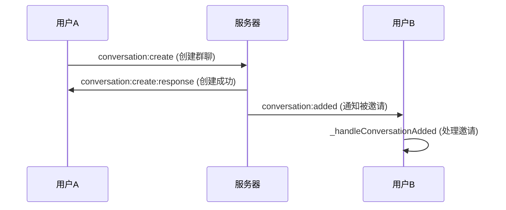

# conversation:added 事件映射修复总结

## 概述

修复了 `conversation:added` 事件的 Proto 映射配置，确保使用正确的 `ConversationCreateResponse` 消息类型，并添加了相应的事件处理逻辑。

## 修复内容

### 1. Proto 事件映射修复

**位置**：`lib/core/services/proto_events.dart`

**修复前**：没有 `conversation:added` 事件映射

**修复后**：
```dart
/// 会话添加通知 → ConversationCreateResponse
'conversation:added': () => conversation.ConversationCreateResponse(),
```

### 2. 事件监听器注册

**位置**：`lib/features/chat/data/repositories/chats_repository_impl.dart`

**添加的监听器**：
```dart
..add(_communicationService
    .onProto<conversation_proto.ConversationCreateResponse>(
        'conversation:added')
    .listen(_handleConversationAdded));
```

### 3. 事件处理方法实现

**新增方法**：`_handleConversationAdded`

**功能特性**：
- 接收 `ConversationCreateResponse` 类型的通知
- 验证响应的成功状态和会话数据完整性
- 将新会话数据转换为本地数据库模型
- 检查会话是否已存在，避免重复添加
- 保存新会话到本地数据库
- 记录详细的日志信息

## 使用场景

### 适用情况
1. **多人群聊创建**：管理员创建群聊并邀请其他成员时
2. **频道邀请**：用户被邀请加入某个频道时
3. **私聊发起**：其他用户主动发起与当前用户的私聊时
4. **跨设备同步**：当前用户在其他设备上创建会话时

### 事件流程


## 数据流处理

### 1. 输入数据验证
- 检查 `response.success` 状态
- 验证 `response.hasConversation()` 确保有会话数据
- 提取会话基本信息（ID、名称、类型）

### 2. 本地数据处理
- 使用 `ConversationAdapter.fromProto()` 转换数据格式
- 查询本地数据库避免重复添加
- 事务性写入确保数据一致性

### 3. 用户反馈（预留）
- 预留用户通知接口
- 可扩展为推送通知或应用内提示

## 错误处理

### 异常情况处理
1. **网络错误**：捕获 Socket.io 连接异常
2. **数据错误**：验证 Proto 消息完整性
3. **数据库错误**：事务失败回滚机制
4. **重复数据**：智能跳过已存在的会话

### 日志记录
- 成功添加：记录会话ID和名称
- 跳过重复：记录已存在的会话ID  
- 错误处理：记录详细错误信息和堆栈

## 技术实现要点

### 1. 类型安全
- 使用强类型的 `ConversationCreateResponse`
- 泛型约束确保消息类型正确

### 2. 并发安全
- 使用 Isar 事务确保数据库操作原子性
- 异步处理避免阻塞主线程

### 3. 资源管理
- 自动注册监听器到 `_subscriptions` 列表
- 确保在 Repository 销毁时正确取消订阅

## 相关接口

### Proto 消息类型
- **ConversationCreateResponse**：会话创建响应/通知
- **ConversationProto**：会话核心数据结构

### 相关事件
- `conversation:create` - 创建会话请求
- `conversation:create:response` - 创建会话响应
- `conversation:created` - 会话创建通知（使用 ConversationProto）
- `conversation:added` - 会话添加通知（使用 ConversationCreateResponse）

## 总结

这次修复完善了会话生命周期的事件处理，确保了多用户协作场景下会话数据的实时同步。通过使用 `ConversationCreateResponse` 作为 `conversation:added` 事件的消息类型，保证了数据结构的一致性和完整性，提升了系统的可靠性和用户体验。 