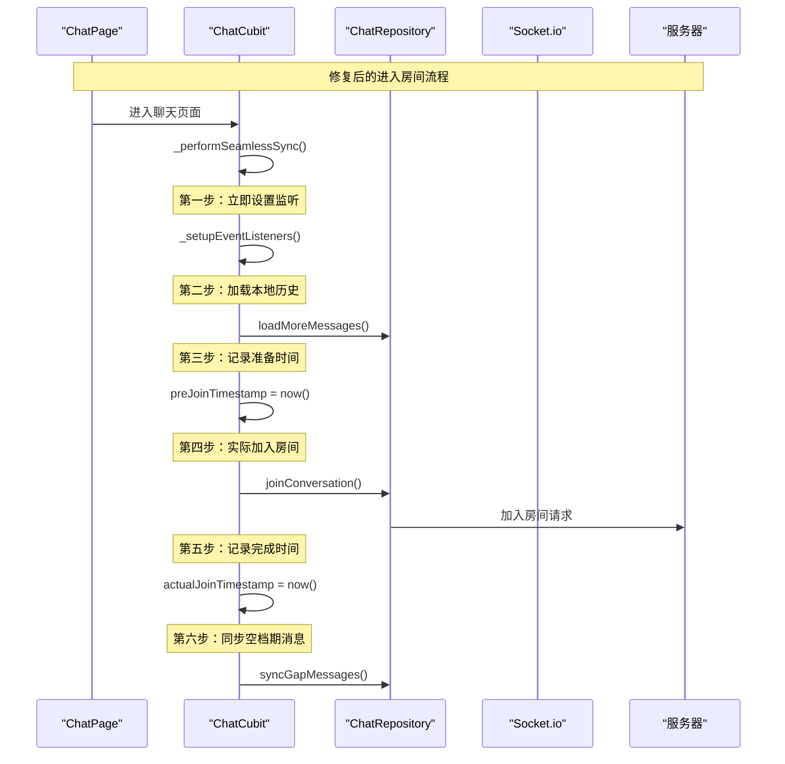

# 进入房间逻辑修复方案

## 🚨 问题分析

### 原始流程存在的问题

1. **时间戳记录过早**
   - 在实际加入房间**之前**就记录了时间戳
   - 导致空档期计算不准确

2. **空档期计算错误**
   - 使用记录时间戳，而非实际加入房间时间
   - 忽略了网络延迟和服务器处理时间

3. **消息丢失风险**
   - 在"即将加入"但"尚未完成加入"的时间窗口内
   - 其他用户发送的消息无法收到

## ✅ 修复方案

### 新的进入房间流程



### 核心改进点

#### 1. 精确的时间控制
```dart
// ❌ 修复前：时间戳记录过早
final roomJoinTimestamp = DateTime.now();  // 在加入房间前就记录
_setupEventListeners();
await joinConversation();  // 实际加入有延迟

// ✅ 修复后：精确的时间段控制
_setupEventListeners();
await loadMoreMessages();
final preJoinTimestamp = DateTime.now();    // 在加入房间前的最后时刻记录
await joinConversation();                   // 实际加入房间
final actualJoinTimestamp = DateTime.now(); // 记录实际完成时间
```

#### 2. 智能的同步策略
```dart
// 确定同步起始时间：取较早者以确保覆盖
final syncFromTimestamp = (lastLocalMessageTime != null && 
    lastLocalMessageTime.isBefore(preJoinTimestamp)) 
    ? lastLocalMessageTime 
    : preJoinTimestamp;

// 同步终止时间：当前时间（确保覆盖整个可能的空档期）
final syncToTimestamp = DateTime.now();
```

#### 3. 详细的日志记录
```dart
// 记录加入房间的完整时间线
_logger.i('加入会话房间成功', extra: {
  'conversationId': conversationId,
  'joinDurationMs': joinDuration.inMilliseconds,
  'joinEndTime': joinEndTime.toIso8601String(),
});
```

## 📊 关键时间节点

### 时间轴示例
```
T0: 设置事件监听    [开始监听 message:new]
T1: 加载本地历史    [获取最新本地消息时间: T_local]
T2: 记录准备时间    [preJoinTimestamp]
T3: 发送加入请求    [conversation:join]
T4: 服务器响应      [房间加入成功]
T5: 记录完成时间    [actualJoinTimestamp]
T6: 开始空档同步    [sync from max(T_local, T2) to now()]
```

### 空档期定义
- **理论空档期**: T2 → T5 (准备加入 → 实际完成)
- **实际同步范围**: max(T_local, T2) → T6 (确保完整覆盖)

## 🔧 技术细节

### 1. 监听器设置优先级
```dart
// 必须最先设置，确保不错过任何消息
_setupEventListeners();
```

### 2. 本地消息加载
```dart
// 获取本地最新消息时间，为空档同步提供基准
await loadMoreMessages();
final latestMessage = state.messages.isNotEmpty ? state.messages.first : null;
```

### 3. 双时间戳策略
```dart
final preJoinTimestamp = DateTime.now();    // 准备加入
await joinConversation();                   // 实际操作
final actualJoinTimestamp = DateTime.now(); // 完成加入
```

### 4. 智能同步范围
```dart
// 取较早的时间作为同步起点，确保不漏掉消息
final syncFromTimestamp = (lastLocalMessageTime != null && 
    lastLocalMessageTime.isBefore(preJoinTimestamp)) 
    ? lastLocalMessageTime 
    : preJoinTimestamp;
```

## 🛡️ 防护机制

### 1. 多层时间保护
- 本地消息时间基准
- 准备加入时间记录
- 实际完成时间验证

### 2. 错误处理增强
```dart
try {
  await joinConversation();
} catch (error) {
  // 从活跃会话集合中移除
  _activeConversations.remove(conversationId);
  rethrow;  // 让上层知道加入失败
}
```

### 3. 日志追踪完整
- 记录每个关键时间点
- 计算操作耗时
- 便于问题诊断

## 📈 性能优化

### 1. 并发处理
- 事件监听与消息加载并行
- 空档同步异步执行
- 不阻塞UI渲染

### 2. 智能同步
- 只在检测到时间差时才同步
- 使用递归分页获取完整消息
- 批量处理提高效率

### 3. 内存优化
- 及时清理失败状态
- 复用现有消息列表结构
- 避免不必要的对象创建

## 🎯 预期效果

### 解决的问题
1. ✅ 消除空档期消息丢失
2. ✅ 精确控制同步时间范围  
3. ✅ 提供详细的操作日志
4. ✅ 增强错误处理能力

### 用户体验改善
1. 📱 消息接收更及时
2. 🔄 房间切换更流畅
3. 🛡️ 数据一致性保证
4. 📊 问题诊断更容易

## 🧪 测试验证

### 测试场景
1. **正常情况**: 快速网络，服务器响应正常
2. **慢网络**: 网络延迟较高，加入房间耗时长
3. **服务器延迟**: 服务器处理时间较长
4. **并发消息**: 加入过程中其他用户发送消息
5. **错误恢复**: 加入失败后的状态恢复

### 验证指标
- 消息完整性：无丢失消息
- 时间准确性：空档期计算正确
- 性能表现：加入房间耗时合理
- 错误处理：失败状态正确回滚
- 日志完整性：操作轨迹清晰

这个修复方案确保了进入房间过程中的消息完整性，消除了空档期消息丢失的问题。 