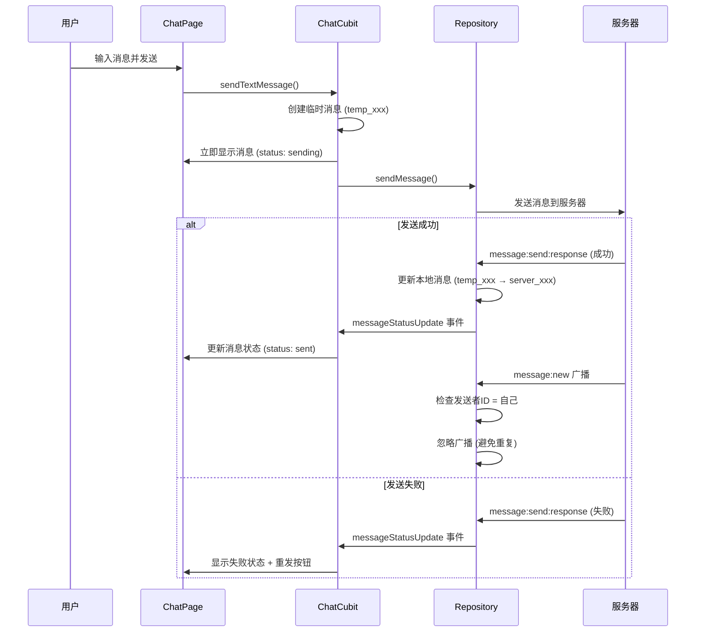
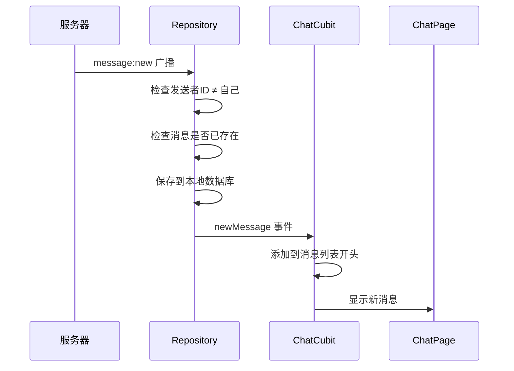

# 消息发送架构设计文档

## 🎯 设计目标

解决消息发送过程中的关键问题：
- **避免消息重复**：防止临时消息与服务器广播消息重复显示
- **状态一致性**：确保本地状态与服务器状态同步
- **用户体验**：立即显示消息，后台异步处理
- **错误处理**：完善的失败重试机制

## 🔄 消息流程架构

### 1. 发送自己的消息



### 2. 接收他人的消息



## 🛠️ 核心实现

### 1. Repository层 - 消息去重逻辑

```dart
/// 处理新消息事件（服务器广播）
void _handleNewMessage(message_proto.MessageProto messageProto) async {
  // 💢 关键：检查是否是自己发送的消息
  if (messageProto.senderId == _currentUser.userId) {
    _logger.d('忽略自己发送的消息广播');
    return; // 避免重复
  }

  // 💢 检查消息是否已存在
  final existingMessage = await getMessageById(messageProto.messageId);
  if (existingMessage != null) {
    _logger.d('消息已存在，忽略重复广播');
    return;
  }

  // 💢 保存新消息并通知UI
  final message = Message.fromProto(messageProto);
  await _isar.writeTxn(() async {
    await _messages.put(message);
  });

  _messageStatusController.add({
    'type': 'newMessage',
    'conversationId': message.conversationId,
    'message': message,
  });
}
```

### 2. ChatCubit层 - 消息状态管理

```dart
/// 处理新消息事件
void _handleNewMessageEvent(Map<String, dynamic> event) {
  final message = event['message'] as Message?;
  
  // 💢 检查消息是否已存在（双重保险）
  final existingMessageIndex = state.messages.indexWhere(
    (msg) => msg.messageId == message.messageId,
  );
  
  if (existingMessageIndex != -1) {
    return; // 忽略重复
  }

  // 💢 将新消息插入到列表开头
  final updatedMessages = [message, ...state.messages];
  _updateMessagesInStateWithTrigger(updatedMessages);
}
```

## 🔐 防重复机制

### 多层防护：

1. **Repository层检查**：
   - 发送者ID检查（忽略自己的消息）
   - 数据库存在性检查

2. **ChatCubit层检查**：
   - 内存中消息列表检查
   - 双重保险防止UI重复

3. **消息ID管理**：
   - 临时ID：`temp_1234567890_123`
   - 服务器ID：`6844723bc1d047912f42977b`
   - ID映射：临时ID → 服务器ID

## 📊 消息状态流转

```
创建消息 → pending → sending → [成功: sent] 或 [失败: failed]
                                    ↓              ↓
                              正常显示        显示重发按钮
```

### 状态说明：
- **pending**: 消息创建，准备发送
- **sending**: 正在发送到服务器
- **sent**: 服务器确认接收
- **delivered**: 对方设备接收
- **read**: 对方已读
- **failed**: 发送失败，可重发

## 🎨 用户体验设计

### 1. 立即反馈
- 用户发送消息后立即显示
- 显示"发送中"状态指示器
- 不阻塞用户继续输入

### 2. 状态可视化
- ⏰ 发送中：时钟图标
- ✓ 已发送：单勾图标
- ✓✓ 已送达：双勾图标（灰色）
- ✓✓ 已读：双勾图标（蓝色）
- ❌ 失败：错误图标 + 重发按钮

### 3. 错误处理
- 失败消息显示红色重发按钮
- 点击重发按钮重新发送
- 提供用户友好的错误提示

## 🔧 技术特点

### 1. 乐观更新
- 消息立即显示，后台异步发送
- 提供最佳用户体验

### 2. 状态触发器
- 使用`messageUpdateTrigger`确保UI及时刷新
- 避免复杂的状态比较逻辑

### 3. 事件驱动
- 基于Stream的事件通信
- 松耦合的组件设计

### 4. 错误恢复
- 自动重试机制
- 手动重发功能
- 完善的错误日志

## 🚀 性能优化

### 1. 内存管理
- 直接修改现有Message对象
- 避免不必要的对象创建

### 2. 网络优化
- 消息去重减少无效处理
- 批量操作减少数据库访问

### 3. UI优化
- 精确的重建条件
- 高效的列表更新

## 🔍 调试和监控

### 日志级别：
- **DEBUG**: 详细的消息处理流程
- **INFO**: 关键状态变化
- **WARN**: 异常情况处理
- **ERROR**: 错误和异常

### 关键监控点：
- 消息发送成功率
- 重复消息检测次数
- 状态更新延迟
- 错误重试次数

## 📝 最佳实践

### 1. 消息ID管理
- 使用时间戳 + 随机数生成临时ID
- 确保临时ID的唯一性
- 及时更新为服务器ID

### 2. 状态同步
- 优先使用服务器状态
- 本地状态作为缓存和优化
- 定期同步确保一致性

### 3. 错误处理
- 区分网络错误和业务错误
- 提供明确的错误信息
- 支持用户手动重试

### 4. 用户体验
- 立即反馈用户操作
- 清晰的状态指示
- 友好的错误提示

这个架构确保了消息发送的可靠性、一致性和良好的用户体验，同时避免了常见的重复消息问题。 